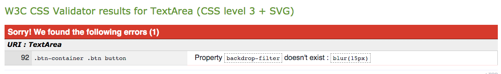

# Star Trek- Memory Game

Code Institute - Milestone project 2 - Interactive Frontend development

This project is a star trek themed memory game built using html, css and javascript.
Currently doesn't work properly on Safari and IOS.
You can visit the deployed site [here](https://daniellaminyo.github.io/Milestone-2/).

## 1. UX

### 1.1. Project Goals

The aim of the project is to create a simple and fun interactive memory game.
Like most memory games, the user can click on two cards that will flip. If the images on the cards match the cards will stay revealed, else they flip back. When all the cards are matched the game is complete.

### 1.2. User stories

- As a user of the site, I'd like to easily use the game.
- As a user I want the game to include fun and interactive features.
- As a user I want the game to be well presented and visually appealing.
- As a user I want to know how long it took me to complete the game.
- As a user I want to easily play the game again.

### 1.3. Wireframes

The wireframes were made using [Balsamiq](https://balsamiq.com/).

[Wireframes](https://github.com/DaniellaMinyo/Milestone-2/blob/main/Wireframes.pdf)

## 2. Features

### 2.1. Existing features

1.  The index page

- with a start button that takes the user to the game.

2.  The game page.

- After all the pairs are matched a pop-up window appears.
- It tells you how many seconds it took for you to complete the game and gives you the options to either exit or play again.
- If you click on exit the game takes you back to the index page.
- If you click play again, the game is reloaded.

### 2.2. Features to implement

- Easy and Hard difficulty levels for the game.
- Adding sound to the cards when they are flipped, and an option to turn off sound.

## 3. Technologies used

- [GitHub](https://github.com/) - was used to host the project.
- [Vscode](https://code.visualstudio.com/) - was used to develop the website.
- [Balsamiq](https://balsamiq.com/) - was used to create the project's wireframes.
- [HTML5](https://en.wikipedia.org/wiki/HTML5) - provides the structure and content for the site.
- [CSS3](https://en.wikipedia.org/wiki/Cascading_Style_Sheets) - provides the styling for the site.
- [Js](https://en.wikipedia.org/wiki/JavaScript) - was used to add functionality.
- [Bootstrap](https://getbootstrap.com/) - was used to create the layout for the site.
- [Google Fonts](https://fonts.google.com/) - was used to provide the fonts for the site.

## 4. Testing

### Code Validators

#### [HTML validator](https://validator.w3.org/)

**Game html**

Two errors occured for the game html page.

The first was solved by taking out the spaces in the name of the mp4 file.

The second error was a bad value error that occured 20 times in the game html. I had to change the code in both the game html and the main js a bit. In the game html I had to give values to the scr and alt (instead of adding it later in js) for each card and in the main js I had to change the shuffle function so that it only shuffled the already given images instead of shuffling the images then assigning them to the img tags.

**Index html**

No warnings or errors occured.

#### [CSS validator](https://jigsaw.w3.org/css-validator/)

**Style css and game css**

The same error popped up in both the style and the game css.
Solved the issue by deleting the property.

#### [JS validator](https://jshint.com/)

**Main js**

Added missing semicolons.

### Responsiveness

- Galaxy S5 - Good
- iPhone 5/6/7/8 - Good
- iPad - Good
- iPad Pro - Good
- Desktop 1024px - Good
- Desktop >1200px - Good

### Browser compatibility

- Chrome: Responsiveness, Appearance and Functionality- Good
- Ecosia: Responsiveness and Appearance and Functionality - Good
- Safari: Responsiveness and Appearance and Functionality- The appearance and responsiveness is good but it does not function properly.

### Testing user stories

- As a user of the site, I'd like to easily use the game.
- As a user I want the game to include fun and interactive features.
- As a user I want the game to be well presented and visually appealing.
  

  

- As a user I want to know how long it took me to complete the game.

  

- As a user I want to easily play the game again.

  

### Bugs

When browsing the site on Safari and IOS - while the appearance and responsiveness is as expected, the functionality does not work properly. When one card is clicked the card flips but then immediately flips back. If two cards are clicked both first flip and flip back, then those two cards plus another random one flips for a second before fliping back. The cards that are matched remain face down.
